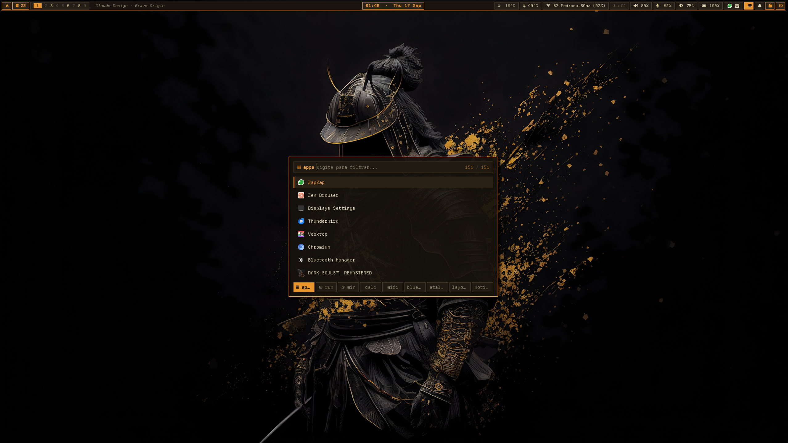

<div align="center">

# ⚡ AMBERGLOW ⚡
### Retro CRT Phosphor Rice for MangoWM & Arch Linux

[](https://archlinux.org/)
[](https://github.com/DreamMaoMao/mangowc)
[](https://github.com/Alexays/Waybar)
[](https://github.com/lbonn/rofi)
[](https://departuremono.com/)

<br>



<br>

*Warm amber phosphor glow • Crisp zero-radius geometry • Solid CRT aesthetic • Zero emojis • Pure typography*

</div>

---

## 🌟 Highlights & Philosophy

- **Retro CRT Phosphor Palette:** Deep obsidian (`#16120c`) paired with vibrant amber (`#e8952d`), dim bronze (`#8a7d63`), and phosphor highlight (`#ffaa40`).
- **Strictly Zero Emojis:** Standardized on **DepartureMono Nerd Font** glyphs and concise retro terminal labels.
- **Audio Feedback & Synchronous OSD:** Instant sound feedback tick when adjusting volume via media keys, with a compact progress-bar OSD rendered via Mako.
- **Dedicated Audio Hub & Pavucontrol:** Instant access to Pavucontrol (`SUPER+A`) or Rofi Audio Selector (`SUPER+Shift+A`) to switch output sinks and input sources on the fly.
- **First-Class Cedilla (`ç`) on Wayland:** Full support for `us-intl` dead keys across Chromium, Brave, and Electron apps powered by Fcitx5, `.XCompose`, and Ozone Wayland IME.
- **Clean Monorepo Tracking:** Repo tracks only rice files out of `$HOME` via an explicit allowlist `.gitignore`.

---

## 🗂️ What's Included

| Path | Description |
| :--- | :--- |
| [`.config/mango/`](.config/mango/) | Compositor config: binds, window rules, monitors, autostart, per-device keyboard rules |
| [`.config/waybar/mango/`](.config/waybar/mango/) | Top bar: tags, active title, media, weather, Pac-Man update chomper, tray, notifications |
| [`.config/rofi/`](.config/rofi/) | Rofi launcher theme + 9 custom script modes (apps, run, win, calc, wifi, bt, keys, layout, audio, notif) |
| [`.config/mako/config`](.config/mako/config) | Notification daemon theme with retro amber progress bar & volume OSD widget |
| [`.config/alacritty/`](.config/alacritty/) | Alacritty terminal configuration with subtle blur transparency and Amberglow palette |
| [`.config/MangoHud/`](.config/MangoHud/) | MangoHud configuration ensuring overlay remains silent (`no_display=1`) for desktop apps |
| [`.config/environment.d/`](.config/environment.d/) | Session environment fixes (Fcitx5 input method, MangoHud crash workaround, cursor theme) |
| [`.local/bin/`](.local/bin/) | Helper scripts and wrappers (Brave, Rofi, Kitty) for environment sanitization and flag parsing |
| [`.local/share/applications/`](.local/share/applications/) | `.desktop` entries with baked-in Wayland flags and theme extensions |
| [`.local/share/chrome-themes/`](.local/share/chrome-themes/) | Unpacked Chromium amber theme extensions for Brave & Helium |
| [`browser-themes/`](browser-themes/) | `userChrome.css` and `user.js` for Zen Browser and LibreWolf |
| [`ly-theme/config.ini`](ly-theme/config.ini) | Themed `ly` display manager configuration |

---

## ⌨️ Keybindings

Over 90 binds defined in [`.config/mango/bind.conf`](.config/mango/bind.conf). The most notable shortcuts:

| Keybinding | Action |
| :--- | :--- |
| `SUPER + D` / `SUPER + Ctrl + Return` | **Rofi Launcher** (cycle modes with `Tab` / `Shift+Tab`) |
| `SUPER + A` | **PulseAudio Volume Control (Pavucontrol GUI)** (floating) |
| `SUPER + Shift + A` | **Rofi Audio Hub** (switch sinks, sources & volume presets) |
| `SUPER + V` | **Clipboard History** (with real image thumbnail previews) |
| `SUPER + Y` | **Layout Switcher** (dynamic cycle across 14 MangoWM layouts) |
| `SUPER + Shift + Q` | **Power Menu** (Lock, Suspend, Reboot, Power Off, Log Out) |
| `SUPER + Shift + W` | **Wallpaper Picker** (interactive image thumbnail grid) |
| `SUPER + Shift + Y` | **Yazi File Manager** (dedicated dropdown scratchpad) |
| `SUPER + Shift + T` | **Kitty Terminal** (dedicated dropdown scratchpad) |
| `SUPER + E` | **Nautilus File Manager** |
| `SUPER + W` / `SUPER + B` | **Brave Browser** (pre-loaded with Amberglow theme) |
| `SUPER + O` | **Obsidian** (knowledge hub) |
| `SUPER + J` | **Ryotunes** (floating centered music player) |
| `SUPER + Space` | **Toggle Floating Window** |
| `SUPER + F` | **Toggle Fullscreen** |
| `SUPER + Tab` | **Toggle Overview** |
| `Print` / `SUPER + Print` | **Screenshots** (saved directly to `~/Pictures/Screenshots`) |
| `XF86AudioRaiseVolume` | **Volume +5%** (sound tick feedback + retro Mako OSD) |
| `XF86AudioLowerVolume` | **Volume -5%** (sound tick feedback + retro Mako OSD) |
| `XF86AudioMute` | **Toggle Audio Mute** (with OSD status) |
| `XF86AudioMicMute` | **Toggle Microphone Mute** (with OSD status) |

---

## 🔊 Audio & OSD Feedback

Volume keys trigger [`~/.config/mango/scripts/volume.sh`](.config/mango/scripts/volume.sh):
1. Adjusts volume using `wpctl`.
2. Emits immediate audio feedback tick using `canberra-gtk-play` or `pw-play` (`audio-volume-change.oga`).
3. Sends a synchronous Mako notification (`-h string:synchronous:volume -h int:value:<pct>`) that updates smoothly in-place without flooding the notification queue.

---

## ⌨️ Cedilla (`ç`) on Wayland / US-Intl

For users with US-International keyboard layouts (`' + c = ç`):
- **Daemon:** Fcitx5 autostarted via [`.config/mango/autostart.sh`](.config/mango/autostart.sh).
- **Environment:** `INPUT_METHOD`, `GTK_IM_MODULE`, `QT_IM_MODULE`, `XMODIFIERS`, and `XCOMPOSEFILE` exported to DBus and systemd in [`.config/mango/env.conf`](.config/mango/env.conf).
- **Compose Table:** Custom [`.XCompose`](.XCompose) file mapping `<dead_acute> + c` to `ç`.
- **Browser Flags:** Automated Wayland IME integration for Brave, Chrome, Chromium, and Electron:
  ```text
  --ozone-platform=wayland
  --enable-wayland-ime
  --wayland-text-input-version=3
  ```

---

## 🚀 Installation

```sh
# 1. Clone the repository
git clone https://github.com/chevalierjvps/dotfiles.git ~/amberglow-dotfiles
cd ~/amberglow-dotfiles

# 2. Copy configurations to ~/.config
cp -r .config/mango .config/waybar .config/rofi .config/mako ~/.config/
mkdir -p ~/.config/environment.d
cp .config/environment.d/*.conf ~/.config/environment.d/
cp .config/*flags.conf ~/.config/ 2>/dev/null || true
cp .XCompose ~/

# 3. Copy helper binaries & application shortcuts
mkdir -p ~/.local/bin ~/.local/share/applications ~/.local/share/chrome-themes
cp -r .local/bin/* ~/.local/bin/
cp .local/share/applications/*.desktop ~/.local/share/applications/
cp -r .local/share/chrome-themes/* ~/.local/share/chrome-themes/

# 4. Ensure scripts are executable
chmod +x ~/.config/mango/scripts/*.sh ~/.config/mango/autostart.sh \
         ~/.config/waybar/mango/scripts/*.sh ~/.config/rofi/scripts/*.sh \
         ~/.local/bin/*
```

---

<div align="center">

Crafted with care by **chevalierjvps**

</div>
